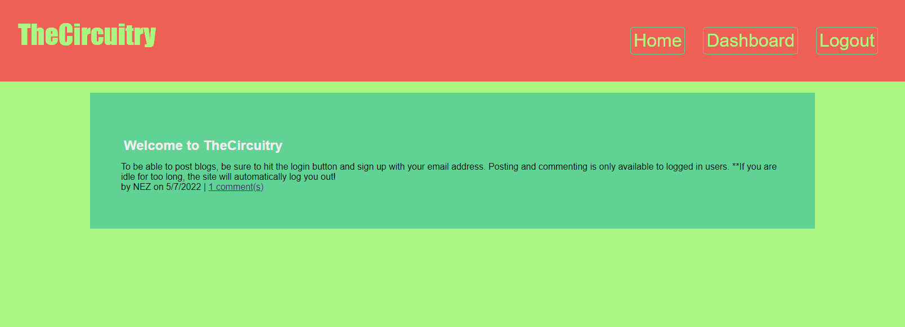

# 🔄 TheCircuitry 🔷

>Post blogs, read and write comments on blogs

## 📃 Instructions
1. Head to [TheCircuitry](https://the-circuitry.herokuapp.com/) website.
2. Click on the "LOGIN" button and sign up with your email account.
3. Navigate to the DASHBOARD to create new blog posts, or click on the comments link on a post to add comments to it.

## 📸 Screenshot

## 🔨 Built With
- HTML
- CSS
- JavaScript
- [NodeJS](https://nodejs.org)
- [Express](https://www.npmjs.com/package/express)
- [Express-Session](https://www.npmjs.com/package/express-session)
- [Handlebars](https://www.npmjs.com/package/handlebars)
- [Sequelize](https://www.npmjs.com/package/sequelize)

## ⚖ License
This project is covered under the [MIT](https://opensource.org/licenses/MIT) license guidelines.
Please visit the link or the [file](./LICENSE) for more details.